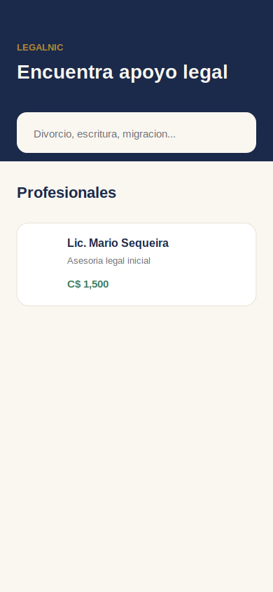
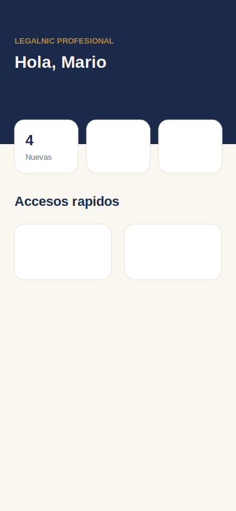
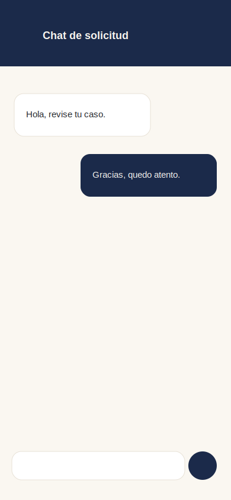
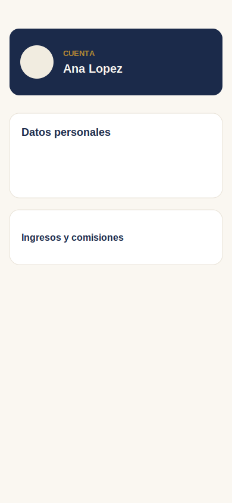

# LegalNic Mobile

App Expo + React Native para ciudadanos, abogados y estudiantes de LegalNic.

## Requisitos

- Node.js compatible con Expo 57.
- Expo CLI mediante `npx expo`.
- Backend `LegalNic.Api` corriendo localmente o en una URL accesible desde el dispositivo.
- Para push notifications reales en Android: Firebase Cloud Messaging configurado con `google-services.json`.

## Variables de entorno

Crear un `.env` o exportar:

```bash
EXPO_PUBLIC_API_URL=http://localhost:5102
```

En dispositivo físico, usa la IP de tu máquina en la red local, por ejemplo:

```bash
EXPO_PUBLIC_API_URL=http://192.168.1.20:5102
```

## Ejecutar

```bash
npm install
npm start
```

Luego abre con Expo Go o un development build.

## Notificaciones push

La app usa:

- `expo-notifications`
- `expo-device`
- FCM/APNs mediante `Notifications.getDevicePushTokenAsync()`
- Endpoint backend: `POST /api/users/me/device-token`

Al iniciar sesión, la app solicita permiso, registra el token del dispositivo y muestra una notificación local de prueba.

Para producción:

- Android requiere `google-services.json` configurado en el proyecto Expo/EAS.
- iOS requiere capacidades APNs y credenciales en Apple Developer/EAS.
- El backend actualmente registra/loguea el token y usa el stub `IPushNotificationService`; falta persistencia duradera y proveedor real FCM/APNs.

## Pantallas principales

| Pantalla | Captura |
| --- | --- |
| Home ciudadano |  |
| Dashboard abogado |  |
| Chat |  |
| Cuenta |  |

## Revisión de calidad

- Las pantallas principales tienen estados de carga, vacío y error.
- Las acciones críticas usan mensajes inline o estados visuales, no alertas genéricas salvo confirmaciones de sistema evitadas.
- Botones base tienen `accessibilityRole` y `accessibilityLabel`.
- Controles solo ícono revisados con etiquetas.
- Tamaño táctil mínimo aplicado en navegación inferior, botones de regreso y acciones principales.
- No se usan animaciones custom; por tanto no hay lógica adicional de reduce motion pendiente.

## Flujos cubiertos

- Ciudadano: Home -> Perfil -> Solicitud -> Mis solicitudes -> Chat -> Calificar -> Cuenta.
- Abogado/Estudiante: Dashboard -> Solicitudes -> Aceptar -> Chat -> Finalizar con precio -> Ingresos/comisiones -> Reseñas -> Cuenta.

## Validación

```bash
npm run typecheck
```

Para validar backend después de cambios de contrato:

```bash
dotnet build LegalNic.Api\LegalNic.Api.csproj
```

Si `LegalNic.Api` está corriendo y bloquea DLLs, compilar con salida alternativa:

```bash
dotnet build LegalNic.Api\LegalNic.Api.csproj -p:OutDir=..\artifacts\api-build\
```

## Pendientes conocidos para producción

- Persistir tokens push en base de datos con relación por usuario/dispositivo y revocación.
- Reemplazar `StubPushNotificationService` por implementación real FCM/APNs.
- Tomar capturas reales en dispositivos físicos SE, estándar y tablet pequeña; las capturas incluidas son referencias visuales.
- Ejecutar QA manual con dos sesiones reales para chat y notificaciones.
- Conectar carga/reemplazo de documentos de verificación desde móvil.
- Completar edición avanzada de disponibilidad con selector horario nativo.
